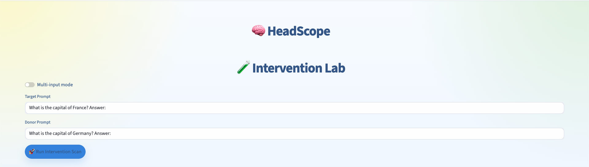
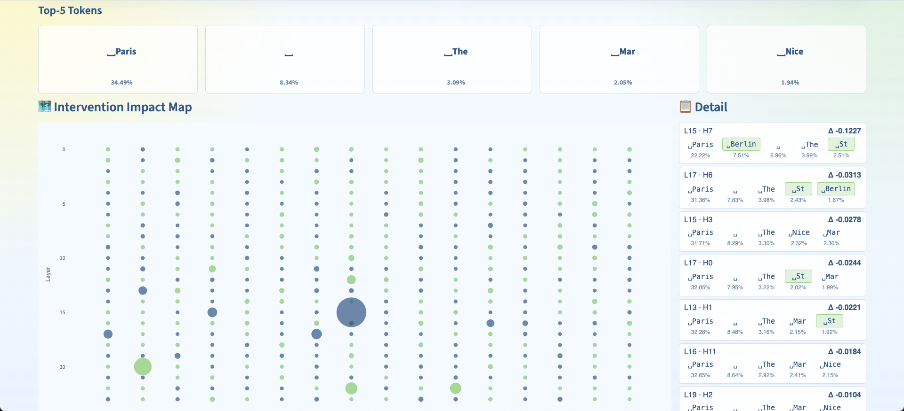
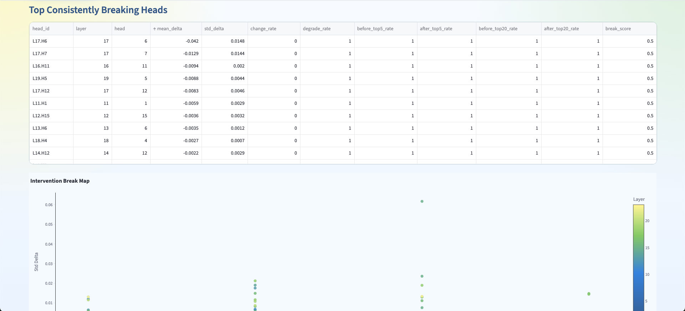
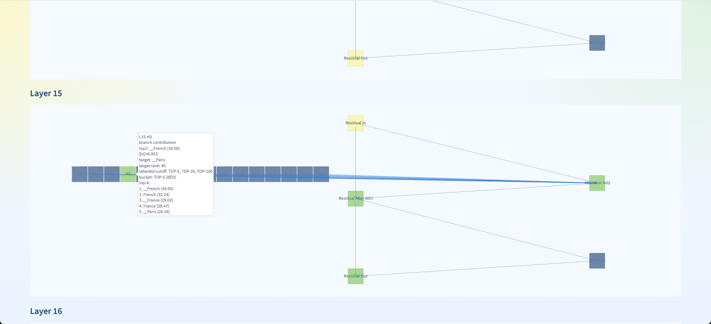
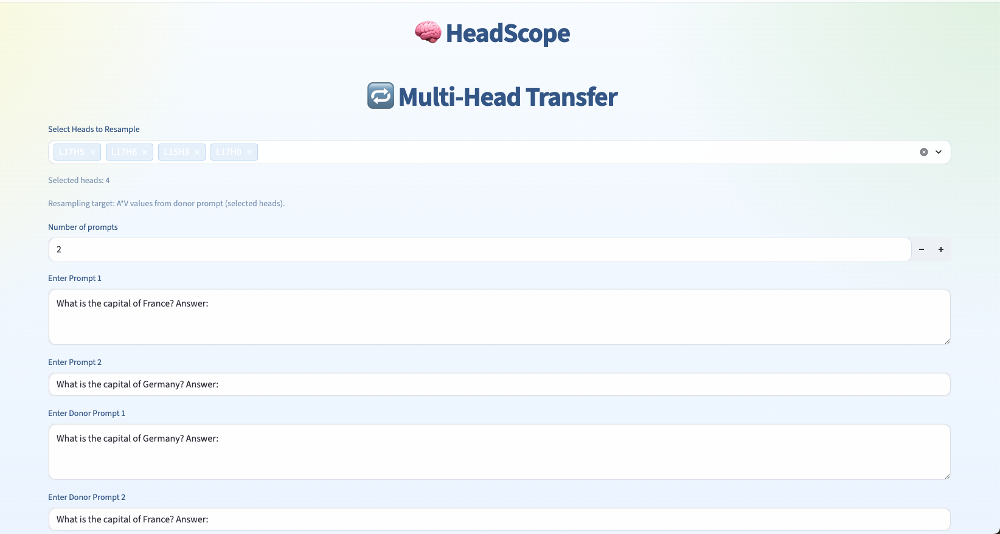
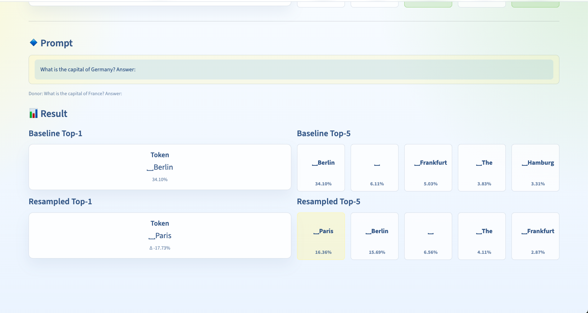

# HeadScope

## Overview

HeadScope는 transformer의 attention head를 직접 개입해 보면서, 어떤 head가 특정 지식이나 출력 패턴에 영향을 주는지 살펴보기 위한 Streamlit 기반 실험 도구입니다.

한두 개의 head를 바꿔보는 실험부터 여러 프롬프트에 걸친 반복 검증, 구조적 해석, multi-head 조합 실험까지 한 흐름으로 이어서 볼 수 있도록 구성했습니다.

현재 기본 분석 대상 모델은 `EleutherAI/pythia-1.4b`이며, 총 384개의 attention head를 기준으로 실험합니다.

## Main Features

### Intervention Lab

- 특정 prompt의 head 표현을 다른 prompt의 정보로 바꿔 넣었을 때 출력이 어떻게 달라지는지 바로 확인할 수 있습니다.
- 어떤 head가 예측을 크게 흔드는지 빠르게 감을 잡을 때 가장 먼저 보기 좋은 페이지입니다.




예를 들어 France에 대한 질문에 답하는 과정에서 일부 head에 Germany 관련 정보를 주입하면, 모델이 `Berlin` 쪽으로 반응하는 모습을 확인할 수 있습니다.

### Stable Head Mining

- 하나의 prompt가 아니라, 같은 주제의 여러 prompt 세트에서 반복적으로 영향력이 나타나는 head를 찾습니다.
- 단일 head뿐 아니라 여러 head 조합에 대해서도 안정적으로 효과가 나타나는지 비교할 수 있습니다.
- `mean_drop_prob`, `degrade_rate`, `escape_rate`, `change_rate`, `break_score` 같은 지표를 통해 결과를 정리합니다.



### Architecture Lens

- layer input, attention add, MLP add, head contribution을 나눠서 마지막 토큰 예측에 어떤 식으로 기여하는지 확인합니다.
- 특정 정보가 어느 layer, 어느 head 부근에서 형성되는지 구조적으로 살펴볼 때 유용합니다.



### Head Logit Lens

- 여러 프롬프트를 한 번에 넣고, 특정 head가 어떤 토큰 방향을 일관되게 밀어주는지 비교합니다.
- 다만 먼저 의미 있는 head 후보를 찾은 뒤 보는 쪽이 편해서, 보통 `Architecture Lens`나 `Stable Head Mining` 다음 단계에서 사용하게 됩니다.

### Multi-Head Transfer

- `Intervention Lab`과 비슷하지만, 여러 head를 동시에 donor 정보로 바꿔 조합 효과를 확인합니다.
- 단일 head로는 약해 보여도 여러 head를 함께 건드렸을 때 출력이 크게 바뀌는 경우를 확인할 수 있습니다.




필요하면 head를 하나씩 추가해 가면서, 어느 조합부터 결과가 무너지기 시작하는지도 실험할 수 있습니다.

### Prompt Sets

- 실험용 프롬프트를 주제별로 저장하고 다시 불러올 수 있습니다.
- 같은 조건으로 반복 실험해야 할 때 간단한 실험 세트 저장소처럼 쓸 수 있습니다.

## Recommended Workflow

1. `Intervention Lab`에서 어떤 종류의 개입이 잘 먹히는지 먼저 확인합니다.
2. 실험에 쓸 prompt들을 `Prompt Sets`에 정리합니다.
3. `Stable Head Mining`으로 반복적으로 영향력이 나타나는 head 후보를 추립니다.
4. `Architecture Lens`와 `Head Logit Lens`로 각 후보가 어떤 역할을 하는지 해석합니다.
5. `Multi-Head Transfer`로 조합 효과까지 확인합니다.

## Current Pages

- `Overview`
- `Intervention Lab`
- `Prompt Sets`
- `Stable Head Mining`
- `Architecture Lens`
- `Head Logit Lens`
- `Multi-Head Transfer`

## Model Support

- Default model: `EleutherAI/pythia-1.4b`
- CUDA가 가능하면 GPU를 사용하고, 그렇지 않으면 CPU로 실행됩니다.

## Tech Stack

- `Streamlit`
- `PyTorch`
- `Transformers`
- `Plotly`

## Run

```bash
pip install -r requirements.txt --ignore-installed blinker
streamlit run main.py
```

## Project Structure

```text
.
├── main.py
├── pages/
├── modules/
├── saved_prompts/
├── img/
└── requirements.txt
```

## Why This Repo

이 프로젝트는 단순히 "중요한 head를 찾는 것"에서 끝나지 않고, 실제로 그 head를 바꿔 보면서 모델의 출력이 어떻게 변하는지까지 확인하는 데 초점을 두고 있습니다.

즉, attention head를 찾고, 흔들어 보고, 해석하고, 다시 검증하는 과정을 한곳에서 반복할 수 있는 실험용 워크벤치에 가깝습니다.
